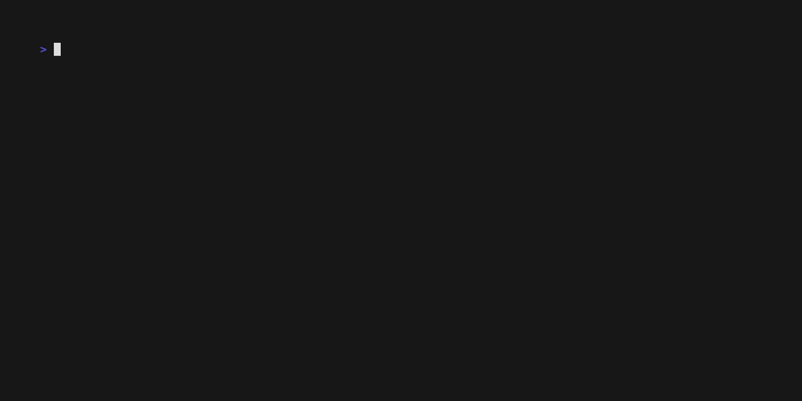

# Kobe

[![Crates.io][crates-badge]][crates-url]
[![Docs.rs][docs-badge]][docs-url]
[![CI][ci-badge]][ci-url]
[![License][license-badge]][license-url]
[![Rust][rust-badge]][rust-url]

[crates-badge]: https://img.shields.io/crates/v/kobe.svg
[crates-url]: https://crates.io/crates/kobe
[docs-badge]: https://img.shields.io/docsrs/kobe.svg
[docs-url]: https://docs.rs/kobe
[ci-badge]: https://github.com/qntx/kobe/actions/workflows/ci.yml/badge.svg
[ci-url]: https://github.com/qntx/kobe/actions/workflows/ci.yml
[license-badge]: https://img.shields.io/badge/license-MIT%2FApache--2.0-blue.svg
[license-url]: LICENSE-MIT
[rust-badge]: https://img.shields.io/badge/rust-edition%202024-orange.svg
[rust-url]: https://doc.rust-lang.org/edition-guide/

**`no_std`-compatible Rust toolkit for multi-chain HD wallet derivation — one BIP-39 seed, twelve networks, zero hand-written cryptography.**

Kobe derives standards-compliant accounts and addresses for Aptos, Bitcoin, Ethereum, Solana, Cosmos, Tron, Sui, TON, Filecoin, Spark, XRP Ledger, and Nostr (NIP-06 / NIP-19) from a single BIP-39 mnemonic. Every library crate builds under `no_std + alloc`; mnemonics, seeds, and private keys are wrapped in `Zeroizing<T>` and wiped on drop.

<p align="center">
  
</p>

## Quick Start

### Install the CLI

**Shell** (macOS / Linux):

```bash
curl -fsSL https://sh.qntx.fun/kobe | sh
```

**PowerShell** (Windows):

```powershell
irm https://sh.qntx.fun/kobe/ps | iex
```

Or via Cargo:

```bash
cargo install kobe-cli
```

### CLI Usage

```bash
# Generate new wallets (default: 12-word English mnemonic, 1 account)
kobe btc new                              # P2WPKH (Native SegWit), mainnet
kobe btc new -a taproot -w 24 -c 5        # 5 Taproot addresses, 24-word mnemonic
kobe evm new                              # Ethereum (MetaMask-compatible)
kobe evm new --style ledger-live -c 3     # Ledger Live layout, 3 accounts
kobe svm new                              # Solana (Phantom / Backpack / Solflare)
kobe cosmos new                           # Cosmos Hub (`cosmos1…`)
kobe aptos new                            # Aptos
kobe sui new                              # Sui
kobe ton new                              # TON wallet v5r1
kobe tron new                             # Tron (base58check `T…`)
kobe fil new                              # Filecoin (`f1…` secp256k1)
kobe spark new                            # Spark (Bitcoin L2), bech32m `spark1…`
kobe xrpl new                             # XRP Ledger classic `r…`
kobe nostr new                            # Nostr NIP-06 (`nsec` / `npub`, NIP-19)

# Import from an existing mnemonic
kobe evm import -m "abandon abandon ... about"

# JSON output — stable, script- and agent-friendly
kobe evm new --json
```

Every chain subcommand accepts the shared flags `-w/--words`, `-c/--count`, `-p/--passphrase`, and `--qr` through a flattened `SimpleArgs` group, so ergonomics stay consistent across the 12 networks.

### Library Usage

```rust
use kobe::{Wallet, Derive};
use kobe::evm::Deriver;  // or kobe::btc, kobe::svm, kobe::cosmos, ...

// Import from mnemonic
let wallet = Wallet::from_mnemonic(
    "abandon abandon abandon abandon abandon abandon abandon abandon abandon abandon abandon about",
    None,  // optional passphrase
)?;

// Derive addresses (accessor methods — fields are private for zeroization safety)
let eth = kobe::evm::Deriver::new(&wallet).derive(0)?;
let btc = kobe::btc::Deriver::new(&wallet, kobe::btc::Network::Mainnet)?.derive(0)?;
let sol = kobe::svm::Deriver::new(&wallet).derive(0)?;

println!("ETH: {}", eth.address());  // 0x9858EfFD232B4033E47d90003D41EC34EcaEda94
println!("BTC: {}", btc.address());  // bc1qcr8te4kr609gcawutmrza0j4xv80jy8z306fyu
println!("SOL: {}", sol.address());  // HAgk14JpMQLgt6rVgv7cBQFJWFto5Dqxi472uT3DKpqk

// Chain-specific extensions via newtypes: `BtcAccount` extends `DerivedAccount`
// with `private_key_wif()`, `address_type()`, `bip32_path()`; `SvmAccount`
// exposes `keypair_base58()`. Both `Deref` to the unified `DerivedAccount`.
println!("BTC WIF: {}", btc.private_key_wif().as_str());
```

```rust
// Generate new wallet
let wallet = Wallet::generate(12, None)?;  // 12-word mnemonic
println!("Mnemonic: {}", wallet.mnemonic());
```

## Design

- **12 chains** — Aptos, Bitcoin, Ethereum, Solana, Cosmos, Tron, Sui, TON, Filecoin, Spark, XRP Ledger, Nostr — one BIP-39 seed
- **HD standards** — BIP-32, BIP-39, BIP-44/49/84/86, SLIP-10, NIP-06, NIP-19
- **Derivation styles** — Standard, Ledger Live, Ledger Legacy, Trust, Phantom, Backpack
- **`no_std` + `alloc`** — All library crates compile without `std`; embedded / WASM ready
- **Zeroizing** — Private keys, seeds, and intermediate material wrapped in `Zeroizing<T>`
- **Shared infrastructure** — SLIP-10 Ed25519 and BIP-32 secp256k1 derivation in `kobe-primitives`
- **KAT-verified** — Every chain has Known Answer Tests cross-verified with Python
- **Strict linting** — Clippy `pedantic` + `nursery` + `correctness` (deny), zero warnings

## Crates

See **[`crates/README.md`](crates/README.md)** for the full crate table, dependency graph, and feature flag reference.

## Mnemonic Camouflage

The `camouflage` feature provides entropy-layer XOR encryption that transforms a real BIP-39 mnemonic into a **different but fully valid** BIP-39 mnemonic. The camouflaged mnemonic is indistinguishable from any ordinary mnemonic — it even generates a real (empty) wallet.

**How it works:**

```text
Real Mnemonic → Entropy (128–256 bit) → XOR(PBKDF2(password)) → New Entropy → Decoy Mnemonic
```

1. The real mnemonic is decoded into its raw entropy (128, 160, 192, 224, or 256 bits).
2. A key of matching length is derived from the password via **PBKDF2-HMAC-SHA256** (600,000 iterations).
3. The entropy is **XORed** with the derived key to produce new entropy.
4. The new entropy is re-encoded as a valid BIP-39 mnemonic with a correct checksum.

Decryption is the same operation — XOR is its own inverse.

**Supported word counts:** 12, 15, 18, 21, and 24 words.

**Security properties:**

| Property | Detail |
| --- | --- |
| **Valid output** | Decoy mnemonic passes all BIP-39 validation and generates a real wallet |
| **Stateless** | No files, databases, or extra data — just the password |
| **Deterministic** | Same input + password always produces the same output |
| **Password-bound** | Security strength equals the password entropy |
| **Brute-force resistant** | PBKDF2 with 600K iterations (OWASP 2023 recommendation) |

> **Note:** This is _not_ the BIP-39 passphrase (25th word). BIP-39 passphrases alter seed derivation; camouflage alters the mnemonic entropy itself.

### Camouflage Library API

```rust
use kobe::camouflage;

// Encrypt (camouflage)
let decoy = camouflage::encrypt("real mnemonic ...", "password")?;

// Decrypt (recover)
let original = camouflage::decrypt(&decoy, "password")?;
```

### Camouflage CLI

```bash
kobe mnemonic encrypt -m "abandon abandon ... art" -p "strong-password"
kobe mnemonic decrypt -c "decoy abandon ... xyz"   -p "strong-password"
```

## Security

This library has **not** been independently audited. Use at your own risk.

- Private keys and seeds use [`zeroize`](https://docs.rs/zeroize) for secure memory cleanup
- No key material is logged or persisted
- Random generation uses OS-provided CSPRNG via [`getrandom`](https://docs.rs/getrandom)
- Secp256k1 contexts are cached to avoid repeated allocations
- Environment variable manipulation is disallowed at the lint level

## License

Licensed under either of:

- Apache License, Version 2.0 ([LICENSE-APACHE](LICENSE-APACHE) or <https://www.apache.org/licenses/LICENSE-2.0>)
- MIT License ([LICENSE-MIT](LICENSE-MIT) or <https://opensource.org/licenses/MIT>)

at your option.

Unless you explicitly state otherwise, any contribution intentionally submitted for inclusion in this project shall be dual-licensed as above, without any additional terms or conditions.

---

<div align="center">

A **[QNTX](https://qntx.fun)** open-source project.

<a href="https://qntx.fun"></a>

<!--prettier-ignore-->
Code is law. We write both.

</div>
